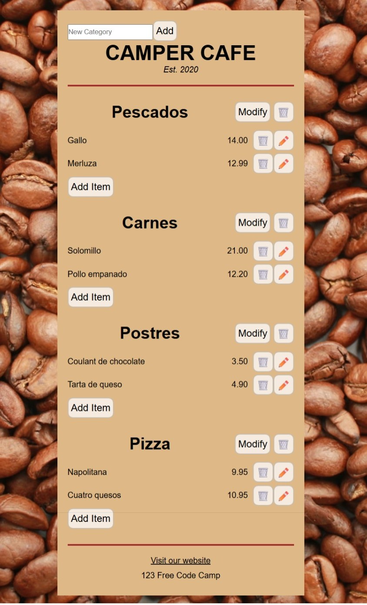

# 🍵 CAMPER CAFE - Gestor de Menú con Fetch API

**Alumno:** Daniel Alonso Farrugia | **Curso:** 2DAM_N | **Asignatura:** PGL

---

## Introducción

Este documento describe los cambios realizados en el proyecto de gestión de cafetería para migrar desde datos locales hardcodeados a una arquitectura con **Fetch API y persistencia en servidor**, manteniendo la interfaz visual pero añadiendo funcionalidad real.

---

## Situación Inicial

El proyecto utilizaba datos estáticos en `JsonData.jsx` con un array hardcodeado de categorías y productos. Todo el CRUD se realizaba manipulando el estado local con `useState`, sin comunicación con servidor. **Los cambios se perdían al recargar la página.**

---

## Implementación de Fetch API

Se creó `src/services/api.js` que centraliza todas las llamadas HTTP usando **Fetch API con `.then()`**:

// Ejemplo: Obtener categorías
function getCategorias() {
return fetch(${API_BASE_URL}/categorias/?usuario_id=${USER_ID})
.then(response => response.json());
}

// Ejemplo: Agregar categoría
function addCategoria(nombre) {
return fetch(${API_BASE_URL}/categorias/, {
method: 'POST',
headers: { 'Content-Type': 'application/json' },
body: JSON.stringify({ usuario_id: USER_ID, nombre })
})
.then(response => response.json());
}

text

Funciones similares para: `updateCategoria()`, `deleteCategoria()`, `getProductos()`, `addProducto()`, `updateProducto()`, `deleteProducto()`.

---

## Cambios en Componentes

**ANTES (estado local):**
const addNewCategory = () => {
let cats = [...categorias];
cats.push({ id: newId, nombre: inputText });
setCategorias(cats); // Se pierde al recargar
};

text

**AHORA (con API):**
const addNewCategory = () => {
addCategoria(inputText)
.then(() => {
setInputText("");
loadData(); // Recarga desde servidor
})
.catch(error => alert('Error al añadir'));
};

text

El componente `App.jsx` ejecuta `loadData()` al montar, que obtiene categorías y sus productos mediante `Promise.all()` para operaciones paralelas.

---

## Resultado

La aplicación **mantiene la misma interfaz**, pero ahora:
- ✅ Datos persistidos en servidor
- ✅ CRUD completo funcional  
- ✅ Cambios se mantienen entre sesiones

---

## Conclusión

Migración exitosa de JsonData local a arquitectura profesional con Fetch API, cumpliendo con requisitos de CRUD real y persistencia en servidor.